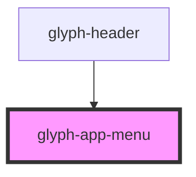

# glyph-app-menu

<!-- Auto Generated Below -->

## Properties

| Property          | Attribute    | Description                                                  | Type                         | Default     |
| ----------------- | ------------ | ------------------------------------------------------------ | ---------------------------- | ----------- |
| `apps`            | --           | List of apps                                                 | `Screen[]`                   | `undefined` |
| `hasSearch`       | `has-search` | Flag to activate search input                                | `boolean`                    | `true`      |
| `i18n`            | --           | Extra i18n translation object                                | `{ [key: string]: string; }` | `{}`        |
| `outsideCallback` | --           | Event triggered when user clicks outside component container | `() => void`                 | `undefined` |

## Dependencies

### Used by

 - [glyph-header](../header)

### Graph

----------------------------------------------

