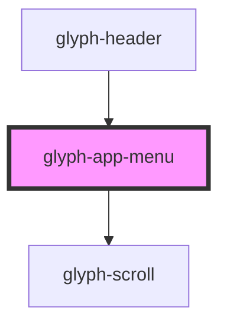

# glyph-app-menu

<!-- Auto Generated Below -->

## Properties

| Property          | Attribute    | Description                                                      | Type                         | Default     |
| ----------------- | ------------ | ---------------------------------------------------------------- | ---------------------------- | ----------- |
| `apps`            | --           | List of apps                                                     | `Screen[]`                   | `undefined` |
| `basePath`        | `base-path`  | Base path to get assets                                          | `string`                     | `undefined` |
| `hasSearch`       | `has-search` | Flag to activate search input                                    | `boolean`                    | `true`      |
| `i18n`            | --           | Extra i18n translation object                                    | `{ [key: string]: string; }` | `{}`        |
| `interface`       | `interface`  | Interface type ['MODERN', 'CLASSIC']                             | `string`                     | `undefined` |
| `locale`          | `locale`     | **optional** force locale change if html lang is not interpreted | `string`                     | `undefined` |
| `outsideCallback` | --           | Event triggered when user clicks outside component container     | `() => void`                 | `undefined` |

## Dependencies

### Used by

 - [glyph-header](../layouts/header)

### Depends on

- [glyph-scroll](../scroll)

### Graph

----------------------------------------------

