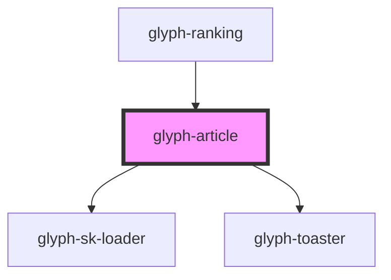

# glyph-article

<!-- Auto Generated Below -->

## Properties

| Property                | Attribute                 | Description                                                                  | Type                         | Default     |
| ----------------------- | ------------------------- | ---------------------------------------------------------------------------- | ---------------------------- | ----------- |
| `article`               | --                        | Article data                                                                 | `Article`                    | `undefined` |
| `aspectRatio`           | `aspect-ratio`            | Aspect ratio used to calculate loader height                                 | `number`                     | `340 / 512` |
| `i18n`                  | --                        | Extra i18n translation object                                                | `{ [key: string]: string; }` | `{}`        |
| `imageType`             | `image-type`              | Image type to render image \| plain_image                                    | `string`                     | `'image'`   |
| `isClickable`           | `is-clickable`            | Flag to activate click callback                                              | `boolean`                    | `undefined` |
| `isVisible`             | --                        | Force visibility flag                                                        | `Boolean`                    | `false`     |
| `loading`               | `loading`                 | Loading flag                                                                 | `boolean`                    | `false`     |
| `parseImageUrl`         | --                        | **optional** Compose image url callback                                      | `(image: string) => string`  | `undefined` |
| `quantityField`         | `quantity-field`          | Field to render quantity tag                                                 | `string`                     | `undefined` |
| `useBackdropDecoration` | `use-backdrop-decoration` | Decorate with backdrop filter, solves some performance issues (in storybook) | `boolean`                    | `true`      |

## Events

| Event            | Description                | Type                   |
| ---------------- | -------------------------- | ---------------------- |
| `articleClick`   | Click event callback       | `CustomEvent<Article>` |
| `articleVisible` | Article gets visible event | `CustomEvent<any>`     |

## Methods

### `getImageSize() => Promise<DOMRect>`

This method will return image height

#### Returns

Type: `Promise<DOMRect>`

### `hideTooltip() => Promise<void>`

This method will hide tooltip

#### Returns

Type: `Promise<void>`

### `setArticleSize() => Promise<void>`

This method will hide tooltip

#### Returns

Type: `Promise<void>`

## Dependencies

### Used by

 - [glyph-ranking](../ranking)

### Depends on

- [glyph-sk-loader](../skeleton-loader)
- [glyph-toaster](../toaster)

### Graph

----------------------------------------------

