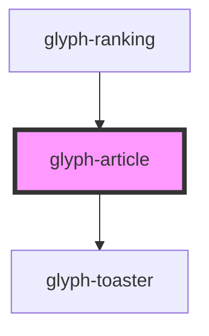

# glyph-article

<!-- Auto Generated Below -->

## Properties

| Property          | Attribute        | Description                               | Type                         | Default     |
| ----------------- | ---------------- | ----------------------------------------- | ---------------------------- | ----------- |
| `article`         | --               | Article data                              | `Article`                    | `undefined` |
| `forceVisibility` | --               | Force visibility flag                     | `Boolean`                    | `false`     |
| `i18n`            | --               | Extra i18n translation object             | `{ [key: string]: string; }` | `{}`        |
| `imageType`       | `image-type`     | Image type to render image \| plain_image | `string`                     | `'image'`   |
| `isClickable`     | `is-clickable`   | Flag to activate click callback           | `boolean`                    | `undefined` |
| `parseImageUrl`   | --               | **optional** Compose image url callback   | `(image: string) => string`  | `undefined` |
| `quantityField`   | `quantity-field` | Field to render quantity tag              | `string`                     | `undefined` |

## Events

| Event          | Description          | Type                   |
| -------------- | -------------------- | ---------------------- |
| `articleClick` | Click event callback | `CustomEvent<Article>` |

## Dependencies

### Used by

 - [glyph-ranking](../ranking)

### Depends on

- [glyph-toaster](../toaster)

### Graph

----------------------------------------------

