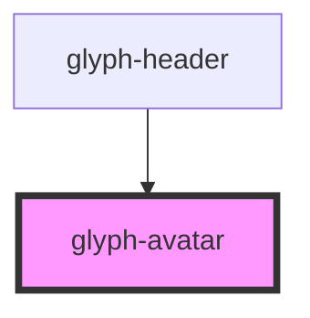

# glyph-avatar

<!-- Auto Generated Below -->

## Properties

| Property | Attribute | Description                       | Type     | Default     |
| -------- | --------- | --------------------------------- | -------- | ----------- |
| `image`  | `image`   | User avatar image                 | `string` | `undefined` |
| `name`   | `name`    | User name, used as image fallback | `string` | `undefined` |

## Dependencies

### Used by

 - [glyph-header](../header)

### Graph

----------------------------------------------

