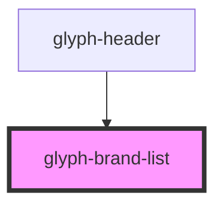

# glyph-brand-list

<!-- Auto Generated Below -->

## Properties

| Property          | Attribute   | Description                              | Type         | Default     |
| ----------------- | ----------- | ---------------------------------------- | ------------ | ----------- |
| `basePath`        | `base-path` | Base path to get assets                  | `string`     | `undefined` |
| `brandList`       | --          | Brand list                               | `Brand[]`    | `undefined` |
| `outsideCallback` | --          | Event triggered when user clicks outside | `() => void` | `undefined` |

## Events

| Event         | Description                   | Type                 |
| ------------- | ----------------------------- | -------------------- |
| `brandChange` | Event triggerd on brand click | `CustomEvent<Brand>` |

## Dependencies

### Used by

 - [glyph-header](../layouts/header)

### Graph

----------------------------------------------

