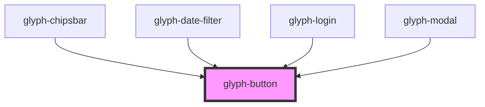

# glyph-button

<!-- Auto Generated Below -->

## Properties

| Property    | Attribute    | Description                                            | Type      | Default     |
| ----------- | ------------ | ------------------------------------------------------ | --------- | ----------- |
| `action`    | `action`     | Action button. Displayed with text only                | `boolean` | `undefined` |
| `cancel`    | `cancel`     | Cancel type button. Renders in red                     | `boolean` | `undefined` |
| `class`     | `class`      | Custom classNames to apply                             | `string`  | `undefined` |
| `icon`      | `icon`       | Material icons id                                      | `string`  | `undefined` |
| `iconFirst` | `icon-first` | Renders icon first                                     | `boolean` | `undefined` |
| `interface` | `interface`  | Interface type ['MODERN', 'CLASSIC']                   | `string`  | `undefined` |
| `text`      | `text`       | Button text                                            | `string`  | `undefined` |
| `tiny`      | `tiny`       | Tiny action button displays a smaller and thinier text | `boolean` | `undefined` |

## Dependencies

### Used by

 - [glyph-chipsbar](../layouts/chipsbar)
 - [glyph-date-filter](../date-filter)
 - [glyph-login](../layouts/login)
 - [glyph-modal](../modal)

### Graph

----------------------------------------------

