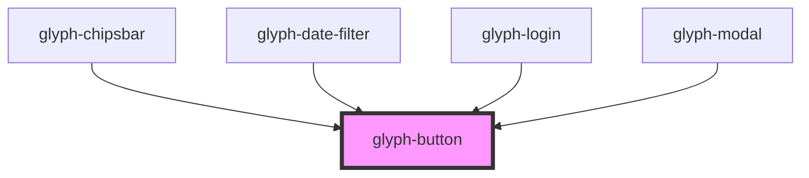

# glyph-button

<!-- Auto Generated Below -->

## Properties

| Property    | Attribute   | Description                          | Type                                        | Default               |
| ----------- | ----------- | ------------------------------------ | ------------------------------------------- | --------------------- |
| `cancel`    | `cancel`    | Cancel type button. Renders in red   | `boolean`                                   | `undefined`           |
| `icon`      | `icon`      | Material icons id                    | `string`                                    | `undefined`           |
| `interface` | `interface` | Interface type ['MODERN', 'CLASSIC'] | `UIInterface.classic \| UIInterface.modern` | `UIInterface.classic` |
| `onlyText`  | `only-text` | Renders only text (without borders)  | `boolean`                                   | `undefined`           |
| `text`      | `text`      | Button text                          | `string`                                    | `undefined`           |

## Dependencies

### Used by

 - [glyph-chipsbar](../chipsbar)
 - [glyph-date-filter](../date-filter)
 - [glyph-login](../layouts/login)
 - [glyph-modal](../modal)

### Graph

----------------------------------------------

