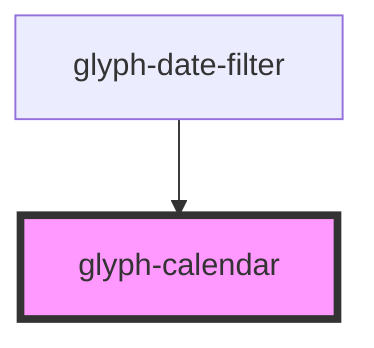

# glyph-calendar

<!-- Auto Generated Below -->

## Properties

| Property       | Attribute       | Description                                                            | Type      | Default                            |
| -------------- | --------------- | ---------------------------------------------------------------------- | --------- | ---------------------------------- |
| `auxActive`    | `aux-active`    | Activate seconday selection display                                    | `boolean` | `undefined`                        |
| `endDate`      | --              | Selected end date                                                      | `Date`    | `new Date()`                       |
| `endDateAux`   | --              | Secondary selected end date                                            | `Date`    | `new Date()`                       |
| `maxDate`      | --              | Maximum allowed date                                                   | `Date`    | `new Date()`                       |
| `maxDateAux`   | --              | Maximum allowed date                                                   | `Date`    | `new Date()`                       |
| `minDate`      | --              | Minimum allowed date                                                   | `Date`    | `dayjs().startOf('year').toDate()` |
| `minDateAux`   | --              | Minimum allowed date                                                   | `Date`    | `dayjs().startOf('year').toDate()` |
| `months`       | `months`        | Number of months to be shown. 2 by default                             | `number`  | `2`                                |
| `secondary`    | `secondary`     | Secondary selection. Shows selection in orange. **requires auxActive** | `boolean` | `undefined`                        |
| `singleSelect` | `single-select` | Allow single day selection                                             | `boolean` | `undefined`                        |
| `startDate`    | --              | Selected start date                                                    | `Date`    | `new Date()`                       |
| `startDateAux` | --              | Secondary selected start date                                          | `Date`    | `new Date()`                       |

## Events

| Event           | Description                           | Type                                                                                |
| --------------- | ------------------------------------- | ----------------------------------------------------------------------------------- |
| `dateSelect`    | Event triggered on date selection     | `CustomEvent<{ startDate: Date; endDate: Date; comparableType?: ComparableType; }>` |
| `dateSelectAux` | Event triggered on aux date selection | `CustomEvent<{ startDate: Date; endDate: Date; }>`                                  |

## Dependencies

### Used by

 - [glyph-date-filter](../date-filter)

### Graph

----------------------------------------------

