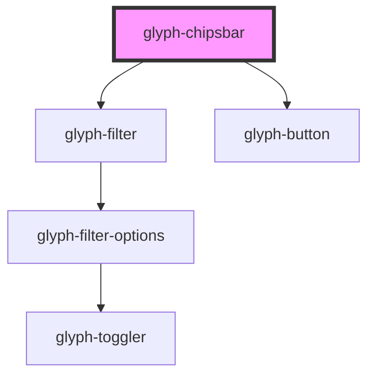

# glyph-chipsbar

<!-- Auto Generated Below -->

## Properties

| Property        | Attribute   | Description                            | Type                                        | Default               |
| --------------- | ----------- | -------------------------------------- | ------------------------------------------- | --------------------- |
| `filtersConfig` | --          | Filters configuration object           | `FiltersConfig`                             | `undefined`           |
| `i18n`          | --          | Extra i18n translation object          | `{ [key: string]: string; }`                | `{}`                  |
| `interface`     | `interface` | Interface type [ 'MODERN', 'CLASSIC' ] | `UIInterface.classic \| UIInterface.modern` | `UIInterface.classic` |

## Events

| Event               | Description              | Type                             |
| ------------------- | ------------------------ | -------------------------------- |
| `clearAll`          | Clear all filters event  | `CustomEvent<any>`               |
| `filterClear`       | Filter clear event       | `CustomEvent<any>`               |
| `filterMultiSelect` | Filter multiselect event | `CustomEvent<any>`               |
| `filterSelect`      | Filter select event      | `CustomEvent<FilterSelectEvent>` |

## Dependencies

### Depends on

- [glyph-filter](../filter)
- [glyph-button](../button)

### Graph

----------------------------------------------

