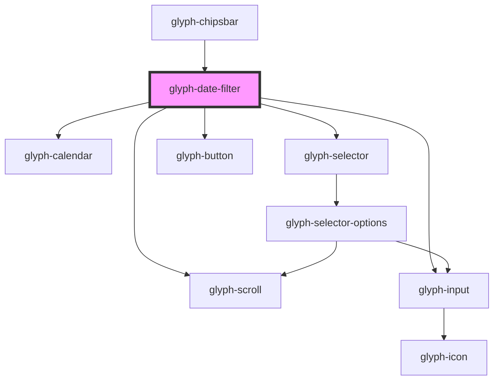

# glyph-date-filter

<!-- Auto Generated Below -->

## Properties

| Property            | Attribute         | Description                                                      | Type                                                                                                      | Default                     |
| ------------------- | ----------------- | ---------------------------------------------------------------- | --------------------------------------------------------------------------------------------------------- | --------------------------- |
| `active`            | `active`          | Active flag                                                      | `boolean`                                                                                                 | `undefined`                 |
| `basePath`          | `base-path`       | Base path to get assets                                          | `string`                                                                                                  | `undefined`                 |
| `comparableOptions` | --                | Comparable options                                               | `SelectorOption[]`                                                                                        | `undefined`                 |
| `comparableType`    | `comparable-type` | Comparabel type                                                  | `ComparableType.calendar \| ComparableType.commercial \| ComparableType.custom \| ComparableType.ordinal` | `ComparableType.commercial` |
| `i18n`              | --                | Extra i18n translation object                                    | `{ [key: string]: string; }`                                                                              | `{}`                        |
| `interface`         | `interface`       | Filter chip interface ['MODERN', 'CLASSIC']                      | `UIInterface.classic \| UIInterface.modern \| UIInterface.redesign`                                       | `UIInterface.classic`       |
| `locale`            | `locale`          | **optional** force locale change if html lang is not interpreted | `string`                                                                                                  | `undefined`                 |
| `maxComparableDate` | --                | Maximum available comp date                                      | `Date`                                                                                                    | `undefined`                 |
| `maxDate`           | --                | Maximum available date                                           | `Date`                                                                                                    | `undefined`                 |
| `minComparableDate` | --                | Minimum available comp date                                      | `Date`                                                                                                    | `undefined`                 |
| `minDate`           | --                | Minimum available date                                           | `Date`                                                                                                    | `undefined`                 |
| `months`            | `months`          | Number of months to be shown. 2 by default                       | `number`                                                                                                  | `2`                         |
| `options`           | --                | Filter options                                                   | `FilterOptionHeader[]`                                                                                    | `undefined`                 |
| `singleSelect`      | `single-select`   | Allow single day selection                                       | `boolean`                                                                                                 | `undefined`                 |

## Events

| Event           | Description                     | Type                             |
| --------------- | ------------------------------- | -------------------------------- |
| `clearEvent`    | Clear selected filters callback | `CustomEvent<any>`               |
| `dateSelection` | Date selection event            | `CustomEvent<FilterSelectEvent>` |

## Methods

### `clearFilter() => Promise<void>`

This method will return image height

#### Returns

Type: `Promise<void>`

## Dependencies

### Used by

 - [glyph-chipsbar](../layouts/chipsbar)

### Depends on

- [glyph-scroll](../scroll)
- [glyph-calendar](../calendar)
- [glyph-selector](../selector)
- [glyph-input](../input)
- [glyph-button](../button)

### Graph

----------------------------------------------

