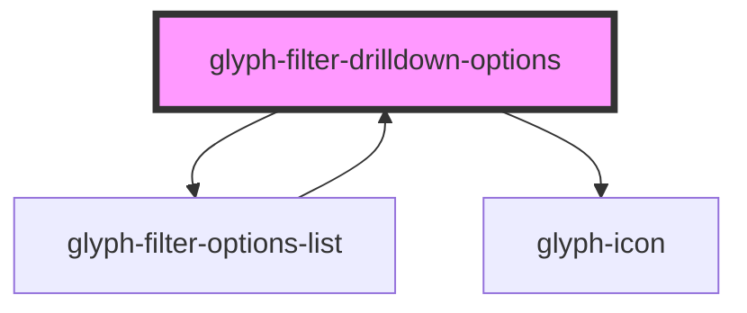

# glyph-filter-drilldown-options

<!-- Auto Generated Below -->

## Properties

| Property      | Attribute      | Description                                 | Type                                                   | Default               |
| ------------- | -------------- | ------------------------------------------- | ------------------------------------------------------ | --------------------- |
| `expanded`    | `expanded`     | Expanded flag                               | `boolean`                                              | `false`               |
| `i18n`        | --             | Extra i18n translation object               | `{ [key: string]: string; }`                           | `{}`                  |
| `interface`   | `interface`    | Filter chip interface ['MODERN', 'CLASSIC'] | `string`                                               | `UIInterface.classic` |
| `option`      | --             | Filter options                              | `FilterOptionHeader`                                   | `undefined`           |
| `optionClick` | --             | Option click event                          | `(option: FilterOptionHeader) => (event: any) => void` | `undefined`           |
| `searchValue` | `search-value` | Search value                                | `string`                                               | `undefined`           |

## Dependencies

### Used by

 - [glyph-filter-options-list](../options-list)

### Depends on

- [glyph-filter-options-list](../options-list)
- [glyph-icon](../../../icon)

### Graph

----------------------------------------------

