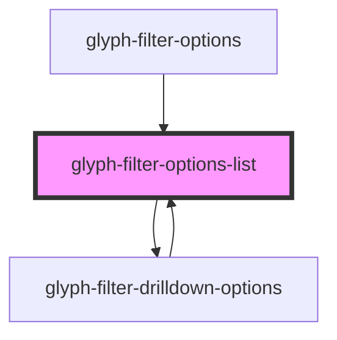

# glyph-filter-options-list

<!-- Auto Generated Below -->

## Properties

| Property      | Attribute      | Description                                 | Type                                                   | Default     |
| ------------- | -------------- | ------------------------------------------- | ------------------------------------------------------ | ----------- |
| `i18n`        | --             | Extra i18n translation object               | `{ [key: string]: string; }`                           | `{}`        |
| `interface`   | `interface`    | Filter chip interface ['MODERN', 'CLASSIC'] | `string`                                               | `undefined` |
| `listStyle`   | --             | Style applied in list                       | `{ [key: string]: string; }`                           | `undefined` |
| `optionClick` | --             | Option click event                          | `(option: FilterOptionHeader) => (event: any) => void` | `undefined` |
| `options`     | --             | Filter options                              | `FilterOptionHeader[]`                                 | `undefined` |
| `searchValue` | `search-value` | Search value                                | `string`                                               | `undefined` |

## Dependencies

### Used by

 - [glyph-filter-drilldown-options](../drilldown-options)
 - [glyph-filter-options](../options)

### Depends on

- [glyph-filter-drilldown-options](../drilldown-options)

### Graph

----------------------------------------------

