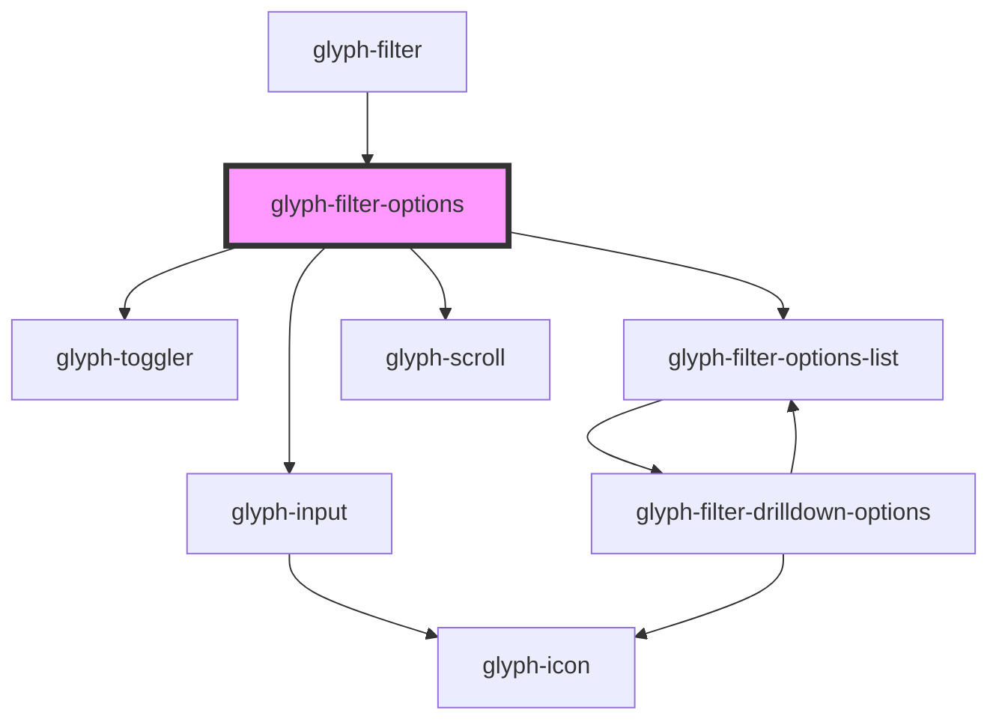

# synth-filter-options

<!-- Auto Generated Below -->

## Properties

| Property            | Attribute            | Description                                                      | Type                                   | Default           |
| ------------------- | -------------------- | ---------------------------------------------------------------- | -------------------------------------- | ----------------- |
| `basePath`          | `base-path`          | Base path to get assets                                          | `string`                               | `undefined`       |
| `closeEvent`        | --                   | Close callback                                                   | `() => void`                           | `undefined`       |
| `description`       | `description`        | Filter description                                               | `string`                               | `undefined`       |
| `haveMultiSelect`   | `have-multi-select`  | Multiselect flag. True if filter allows multiselect toggler      | `boolean`                              | `true`            |
| `i18n`              | --                   | Extra i18n translation object                                    | `{ [key: string]: string; }`           | `{}`              |
| `interface`         | `interface`          | Filter chip interface ['MODERN', 'CLASSIC']                      | `string`                               | `state.interface` |
| `locale`            | `locale`             | **optional** force locale change if html lang is not interpreted | `string`                               | `undefined`       |
| `multiSelect`       | `multi-select`       | This flag is true if multiselect is active                       | `boolean`                              | `false`           |
| `multiSelectEvent`  | --                   | Multiselect toggler callback                                     | `() => void`                           | `undefined`       |
| `optionClickEvent`  | --                   | Option click event                                               | `(option: FilterOptionHeader) => void` | `undefined`       |
| `options`           | --                   | Filter options                                                   | `FilterOptionHeader[]`                 | `undefined`       |
| `searchPlaceholder` | `search-placeholder` | Search placeholder                                               | `string`                               | `undefined`       |

## Dependencies

### Used by

 - [glyph-filter](../..)

### Depends on

- [glyph-input](../../../input)
- [glyph-toggler](../../../toggler)
- [glyph-filter-options-list](../options-list)
- [glyph-scroll](../../../scroll)

### Graph

----------------------------------------------

