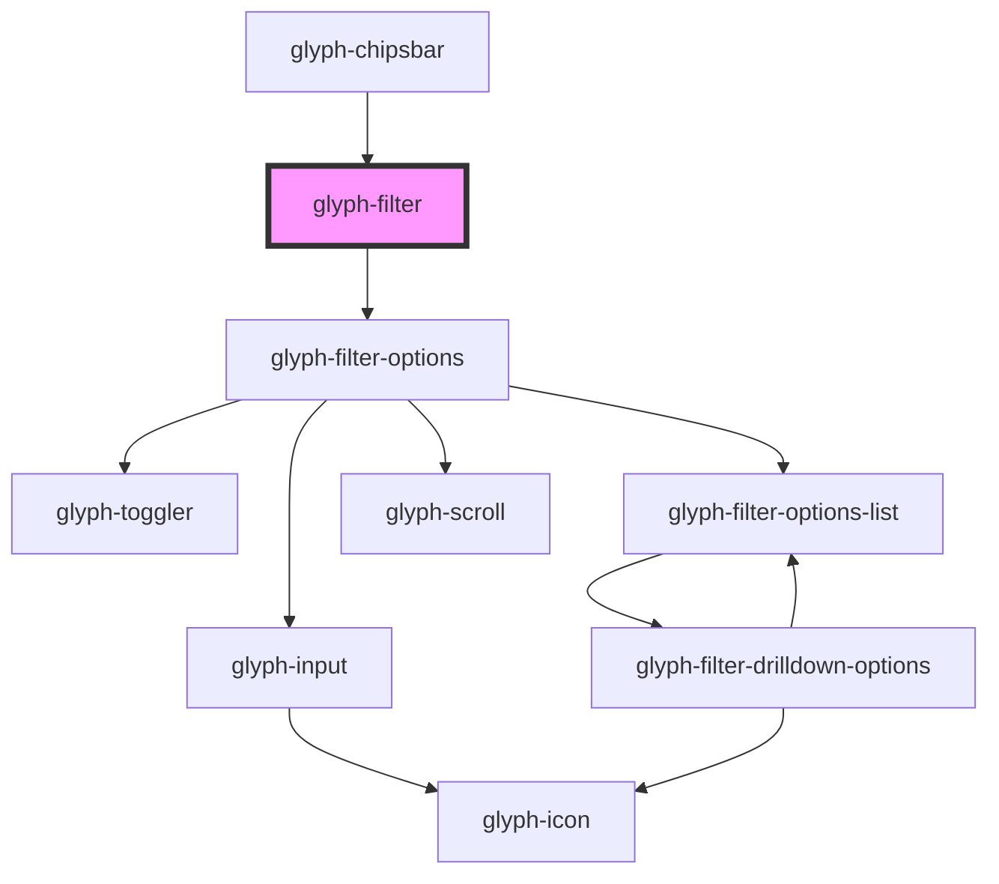

# glyph-filter

<!-- Auto Generated Below -->

## Properties

| Property            | Attribute            | Description                                                      | Type                         | Default     |
| ------------------- | -------------------- | ---------------------------------------------------------------- | ---------------------------- | ----------- |
| `basePath`          | `base-path`          | Base path to get assets                                          | `string`                     | `undefined` |
| `description`       | `description`        | Filter description                                               | `string`                     | `undefined` |
| `haveMultiSelect`   | `have-multi-select`  | Multiselect flag. True if filter allows multiselect toggler      | `boolean`                    | `true`      |
| `i18n`              | --                   | Extra i18n translation object                                    | `{ [key: string]: string; }` | `{}`        |
| `interface`         | `interface`          | Filter chip interface ['MODERN', 'CLASSIC']                      | `string`                     | `undefined` |
| `locale`            | `locale`             | **optional** force locale change if html lang is not interpreted | `string`                     | `undefined` |
| `multiSelect`       | `multi-select`       | This flag is true if multiselect is active                       | `boolean`                    | `false`     |
| `options`           | --                   | Filter options                                                   | `FilterOptionHeader[]`       | `undefined` |
| `plural`            | `plural`             | Filter plural                                                    | `string`                     | `undefined` |
| `searchPlaceholder` | `search-placeholder` | Search placeholder                                               | `string`                     | `undefined` |

## Events

| Event              | Description                     | Type                             |
| ------------------ | ------------------------------- | -------------------------------- |
| `clear`            | Clear selected filters callback | `CustomEvent<any>`               |
| `multiSelectEvent` | Multiselect toggler callback    | `CustomEvent<any>`               |
| `optionClick`      | Option click event              | `CustomEvent<FilterSelectEvent>` |

## Methods

### `clearFilter() => Promise<void>`

This method will return image height

#### Returns

Type: `Promise<void>`

## Dependencies

### Used by

 - [glyph-chipsbar](../layouts/chipsbar)

### Depends on

- [glyph-filter-options](./components/options)

### Graph

----------------------------------------------

