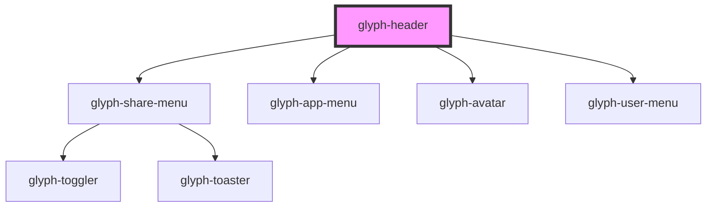

# glyph-header

<!-- Auto Generated Below -->

## Properties

| Property        | Attribute       | Description                          | Type                                                                                                                                                                       | Default               |
| --------------- | --------------- | ------------------------------------ | -------------------------------------------------------------------------------------------------------------------------------------------------------------------------- | --------------------- |
| `activeBrand`   | `active-brand`  | Application brand                    | `Brands.bershka \| Brands.home \| Brands.lefties \| Brands.massimo \| Brands.oysho \| Brands.pull \| Brands.south \| Brands.stradivarius \| Brands.uterque \| Brands.zara` | `undefined`           |
| `appData`       | --              | Apps data                            | `Screen[]`                                                                                                                                                                 | `undefined`           |
| `appSubtitle`   | `app-subtitle`  | Application subtitle                 | `string`                                                                                                                                                                   | `undefined`           |
| `appTitle`      | `app-title`     | Application title                    | `string`                                                                                                                                                                   | `undefined`           |
| `avatar`        | `avatar`        | User avatar flag                     | `boolean`                                                                                                                                                                  | `undefined`           |
| `brand`         | `brand`         | Brand selector flag                  | `boolean`                                                                                                                                                                  | `undefined`           |
| `i18n`          | --              | Extra i18n translation object        | `{ [key: string]: string; }`                                                                                                                                               | `{}`                  |
| `interface`     | `interface`     | Interface type ['MODERN', 'CLASSIC'] | `UIInterface.classic \| UIInterface.modern`                                                                                                                                | `UIInterface.classic` |
| `menu`          | `menu`          | View menu flag                       | `boolean`                                                                                                                                                                  | `undefined`           |
| `notifications` | `notifications` | Notification flag                    | `boolean`                                                                                                                                                                  | `undefined`           |
| `search`        | `search`        | Search flag                          | `boolean`                                                                                                                                                                  | `undefined`           |
| `share`         | `share`         | Share menu flag                      | `boolean`                                                                                                                                                                  | `undefined`           |
| `timeline`      | `timeline`      | Timeline flag                        | `boolean`                                                                                                                                                                  | `undefined`           |
| `userData`      | --              | User data                            | `UserData`                                                                                                                                                                 | `undefined`           |

## Dependencies

### Depends on

- [glyph-share-menu](../share-menu)
- [glyph-app-menu](../app-menu)
- [glyph-avatar](../avatar)
- [glyph-user-menu](../user-menu)

### Graph

----------------------------------------------

