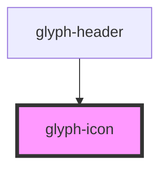

# glyph-icon

<!-- Auto Generated Below -->

## Properties

| Property   | Attribute  | Description                               | Type                         | Default     |
| ---------- | ---------- | ----------------------------------------- | ---------------------------- | ----------- |
| `button`   | `button`   | render icon with button role              | `boolean`                    | `undefined` |
| `class`    | `class`    | class to use in icon                      | `string`                     | `undefined` |
| `clickCbk` | --         | click callback                            | `(event: MouseEvent) => any` | `undefined` |
| `icon`     | `icon`     | icon name                                 | `string`                     | `undefined` |
| `material` | `material` | render material icon                      | `boolean`                    | `undefined` |
| `outlined` | `outlined` | render outlined icon (for material icons) | `boolean`                    | `false`     |

## Dependencies

### Used by

 - [glyph-header](../layouts/header)

### Graph

----------------------------------------------

