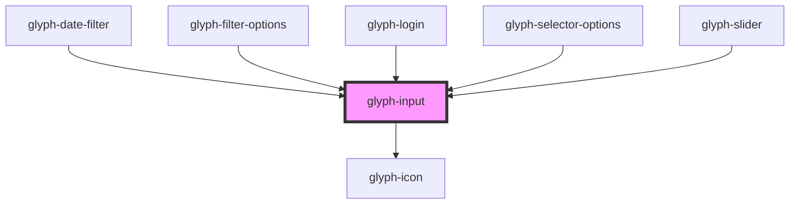

# glyph-input

<!-- Auto Generated Below -->

## Properties

| Property      | Attribute     | Description                                          | Type                                                                | Default               |
| ------------- | ------------- | ---------------------------------------------------- | ------------------------------------------------------------------- | --------------------- |
| `autoFocus`   | `auto-focus`  | Input should auto focus                              | `boolean`                                                           | `undefined`           |
| `box`         | `box`         | Renders input in a box                               | `boolean`                                                           | `undefined`           |
| `disabled`    | `disabled`    | Flag to disable input                                | `boolean`                                                           | `undefined`           |
| `error`       | `error`       | Style input as an error                              | `boolean`                                                           | `undefined`           |
| `inputType`   | `input-type`  | Input type                                           | `string`                                                            | `'text'`              |
| `interface`   | `interface`   | Filter chip interface ['MODERN', 'CLASSIC']          | `UIInterface.classic \| UIInterface.modern \| UIInterface.redesign` | `UIInterface.classic` |
| `max`         | `max`         | Maximum availabla for inputs (dates or ranges)       | `any`                                                               | `undefined`           |
| `min`         | `min`         | Minimum available for inputs (dates or ranges)       | `any`                                                               | `undefined`           |
| `placeholder` | `placeholder` | Placeholder                                          | `string`                                                            | `undefined`           |
| `search`      | `search`      | Search flag, renders a search icon if `box` is false | `boolean`                                                           | `undefined`           |
| `value`       | `value`       | Input value                                          | `any`                                                               | `undefined`           |

## Events

| Event         | Description       | Type                  |
| ------------- | ----------------- | --------------------- |
| `enterKey`    | Enter key event   | `CustomEvent<any>`    |
| `inputChange` | Text change event | `CustomEvent<string>` |

## Dependencies

### Used by

 - [glyph-date-filter](../date-filter)
 - [glyph-filter-options](../filter/components/options)
 - [glyph-login](../layouts/login)
 - [glyph-selector-options](../selector/options)
 - [glyph-slider](../slider)

### Depends on

- [glyph-icon](../icon)

### Graph

----------------------------------------------

