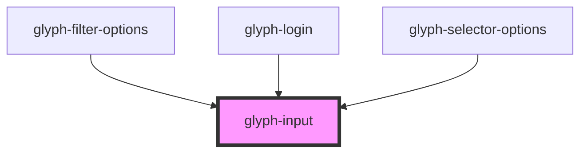

# glyph-input

<!-- Auto Generated Below -->

## Properties

| Property      | Attribute     | Description                                          | Type      | Default     |
| ------------- | ------------- | ---------------------------------------------------- | --------- | ----------- |
| `autoFocus`   | `auto-focus`  | Input should auto focus                              | `boolean` | `undefined` |
| `box`         | `box`         | Renders input in a box                               | `boolean` | `undefined` |
| `error`       | `error`       | Style input as an error                              | `boolean` | `undefined` |
| `inputType`   | `input-type`  | Input type                                           | `string`  | `'text'`    |
| `placeholder` | `placeholder` | Placeholder                                          | `string`  | `undefined` |
| `search`      | `search`      | Search flag, renders a search icon if `box` is false | `boolean` | `undefined` |

## Events

| Event        | Description       | Type                  |
| ------------ | ----------------- | --------------------- |
| `enterKey`   | Enter key event   | `CustomEvent<any>`    |
| `textChange` | Text change event | `CustomEvent<string>` |

## Dependencies

### Used by

 - [glyph-filter-options](../filter/components/options)
 - [glyph-login](../layouts/login)
 - [glyph-selector-options](../selector/options)

### Graph

----------------------------------------------

