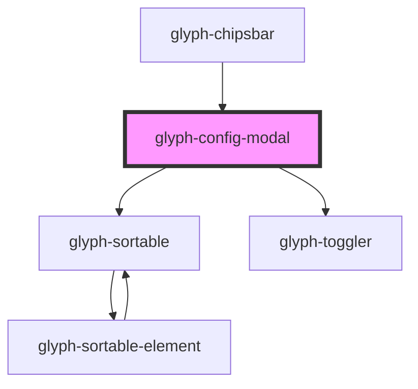

# glyph-config-modal

<!-- Auto Generated Below -->

## Properties

| Property        | Attribute         | Description                            | Type                                        | Default               |
| --------------- | ----------------- | -------------------------------------- | ------------------------------------------- | --------------------- |
| `filtersConfig` | --                | Filters configuration                  | `FiltersConfig`                             | `undefined`           |
| `hideZaraSouth` | `hide-zara-south` | Hide zara south filters active         | `boolean`                                   | `undefined`           |
| `i18n`          | --                | Extra i18n translation object          | `{ [key: string]: string; }`                | `{}`                  |
| `interface`     | `interface`       | Interface type [ 'MODERN', 'CLASSIC' ] | `UIInterface.classic \| UIInterface.modern` | `UIInterface.classic` |

## Events

| Event          | Description                       | Type                         |
| -------------- | --------------------------------- | ---------------------------- |
| `configChange` | Filter configuration change event | `CustomEvent<FiltersConfig>` |

## Dependencies

### Used by

 - [glyph-chipsbar](..)

### Depends on

- [glyph-sortable](../../../sortable-list)
- [glyph-toggler](../../../toggler)

### Graph

----------------------------------------------

