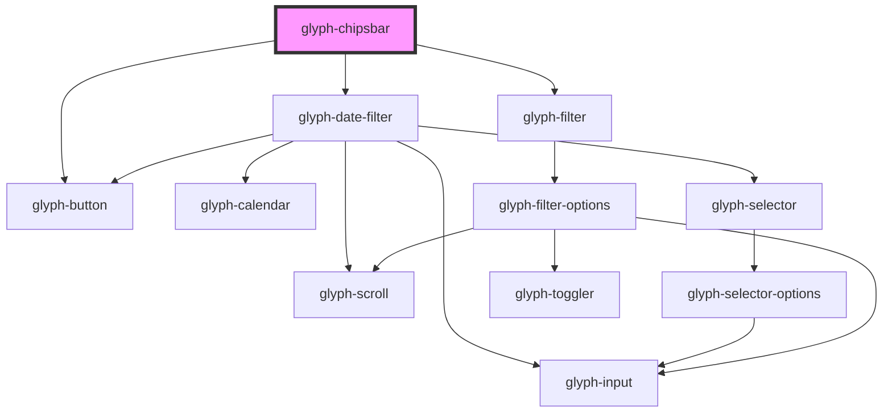

# glyph-chipsbar

<!-- Auto Generated Below -->

## Properties

| Property        | Attribute   | Description                            | Type                                        | Default               |
| --------------- | ----------- | -------------------------------------- | ------------------------------------------- | --------------------- |
| `filtersConfig` | --          | Filters configuration object           | `FiltersConfig`                             | `undefined`           |
| `i18n`          | --          | Extra i18n translation object          | `{ [key: string]: string; }`                | `{}`                  |
| `interface`     | `interface` | Interface type [ 'MODERN', 'CLASSIC' ] | `UIInterface.classic \| UIInterface.modern` | `UIInterface.classic` |

## Events

| Event                     | Description                  | Type                                                                                                                   |
| ------------------------- | ---------------------------- | ---------------------------------------------------------------------------------------------------------------------- |
| `clearAll`                | Clear all filters event      | `CustomEvent<any>`                                                                                                     |
| `comparableChange`        | Comparable type change event | `CustomEvent<ComparableType.calendar \| ComparableType.commercial \| ComparableType.custom \| ComparableType.ordinal>` |
| `comparableDateSelection` | Date selection event         | `CustomEvent<DateSelectionEvent>`                                                                                      |
| `dateSelection`           | Date selection event         | `CustomEvent<DateSelectionEvent>`                                                                                      |
| `filterClear`             | Filter clear event           | `CustomEvent<string>`                                                                                                  |
| `filterSelect`            | Filter select event          | `CustomEvent<FilterSelectEvent>`                                                                                       |
| `updateFilter`            | Filter multiselect event     | `CustomEvent<FilterUpdateEvent>`                                                                                       |

## Dependencies

### Depends on

- [glyph-date-filter](../../date-filter)
- [glyph-filter](../../filter)
- [glyph-button](../../button)

### Graph

----------------------------------------------

