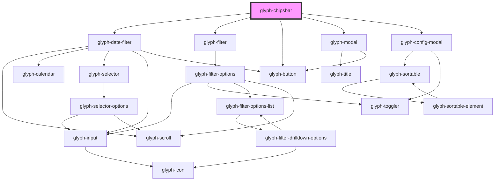

# glyph-chipsbar

<!-- Auto Generated Below -->

## Properties

| Property        | Attribute         | Description                                                      | Type                         | Default               |
| --------------- | ----------------- | ---------------------------------------------------------------- | ---------------------------- | --------------------- |
| `basePath`      | `base-path`       | Base path to get assets                                          | `string`                     | `undefined`           |
| `filtersConfig` | --                | Filters configuration object                                     | `FiltersConfig`              | `undefined`           |
| `hideZaraSouth` | `hide-zara-south` | Hide zara south filters active                                   | `boolean`                    | `true`                |
| `i18n`          | --                | Extra i18n translation object                                    | `{ [key: string]: string; }` | `{}`                  |
| `interface`     | `interface`       | Interface type                                                   | `string`                     | `UIInterface.classic` |
| `locale`        | `locale`          | **optional** force locale change if html lang is not interpreted | `string`                     | `undefined`           |

## Events

| Event          | Description              | Type                             |
| -------------- | ------------------------ | -------------------------------- |
| `clearAll`     | Clear all filters event  | `CustomEvent<any>`               |
| `filterClear`  | Filter clear event       | `CustomEvent<string>`            |
| `filterSelect` | Filter select event      | `CustomEvent<FilterSelectEvent>` |
| `updateFilter` | Filter multiselect event | `CustomEvent<FilterUpdateEvent>` |

## Dependencies

### Depends on

- [glyph-date-filter](../../date-filter)
- [glyph-filter](../../filter)
- [glyph-button](../../button)
- [glyph-modal](../../modal)
- [glyph-config-modal](components)

### Graph

----------------------------------------------

