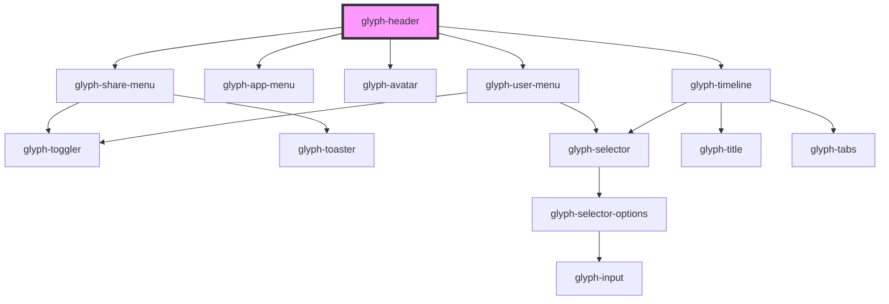

# glyph-header

<!-- Auto Generated Below -->

## Properties

| Property         | Attribute       | Description                                                      | Type                                                                                                                                                                       | Default               |
| ---------------- | --------------- | ---------------------------------------------------------------- | -------------------------------------------------------------------------------------------------------------------------------------------------------------------------- | --------------------- |
| `activeBrand`    | `active-brand`  | Application brand                                                | `Brands.bershka \| Brands.home \| Brands.lefties \| Brands.massimo \| Brands.oysho \| Brands.pull \| Brands.south \| Brands.stradivarius \| Brands.uterque \| Brands.zara` | `undefined`           |
| `appData`        | --              | Apps data                                                        | `Screen[]`                                                                                                                                                                 | `undefined`           |
| `appSubtitle`    | `app-subtitle`  | Application subtitle                                             | `string`                                                                                                                                                                   | `undefined`           |
| `appTitle`       | `app-title`     | Application title                                                | `string`                                                                                                                                                                   | `undefined`           |
| `avatar`         | `avatar`        | User avatar flag                                                 | `boolean`                                                                                                                                                                  | `undefined`           |
| `basePath`       | `base-path`     | Base path to get assets                                          | `string`                                                                                                                                                                   | `undefined`           |
| `brand`          | `brand`         | Brand selector flag                                              | `boolean`                                                                                                                                                                  | `undefined`           |
| `calendarEvents` | --              | Calendar events                                                  | `TimelineEvent[]`                                                                                                                                                          | `undefined`           |
| `events`         | --              | Events                                                           | `TimelineEvent[]`                                                                                                                                                          | `undefined`           |
| `i18n`           | --              | Extra i18n translation object                                    | `{ [key: string]: string; }`                                                                                                                                               | `{}`                  |
| `interface`      | `interface`     | Interface type ['MODERN', 'CLASSIC']                             | `UIInterface.classic \| UIInterface.modern`                                                                                                                                | `UIInterface.classic` |
| `locale`         | `locale`        | **optional** force locale change if html lang is not interpreted | `string`                                                                                                                                                                   | `undefined`           |
| `menu`           | `menu`          | View menu flag                                                   | `boolean`                                                                                                                                                                  | `undefined`           |
| `notifications`  | `notifications` | Notification flag                                                | `boolean`                                                                                                                                                                  | `undefined`           |
| `search`         | `search`        | Search flag                                                      | `boolean`                                                                                                                                                                  | `undefined`           |
| `share`          | `share`         | Share menu flag                                                  | `boolean`                                                                                                                                                                  | `undefined`           |
| `timeline`       | `timeline`      | Timeline flag                                                    | `boolean`                                                                                                                                                                  | `undefined`           |
| `userData`       | --              | User data                                                        | `UserData`                                                                                                                                                                 | `undefined`           |
| `userMenuConfig` | --              | User menu config                                                 | `UserMenuConfiguration`                                                                                                                                                    | `undefined`           |

## Events

| Event            | Description           | Type                          |
| ---------------- | --------------------- | ----------------------------- |
| `decimalsChange` | Decimals change event | `CustomEvent<boolean>`        |
| `langChange`     | Language change event | `CustomEvent<SelectorOption>` |
| `logout`         | Logout event          | `CustomEvent<any>`            |
| `themeChange`    | Theme change event    | `CustomEvent<SelectorOption>` |

## Dependencies

### Depends on

- [glyph-share-menu](../../share-menu)
- [glyph-app-menu](../../app-menu)
- [glyph-avatar](../../avatar)
- [glyph-user-menu](../../user-menu)
- [glyph-timeline](../../timeline)

### Graph

----------------------------------------------

