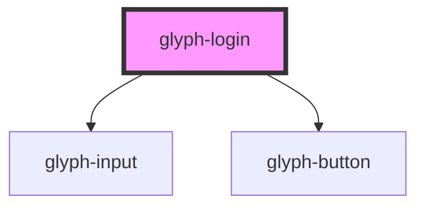

# glyph-login

<!-- Auto Generated Below -->

## Properties

| Property       | Attribute   | Description                                                      | Type                                                      | Default              |
| -------------- | ----------- | ---------------------------------------------------------------- | --------------------------------------------------------- | -------------------- |
| `basePath`     | `base-path` | Base path to get assets                                          | `string`                                                  | `''`                 |
| `i18n`         | --          | Extra i18n translates                                            | `{ [key: string]: string; }`                              | `undefined`          |
| `interface`    | `interface` | Component interface *modern* \| *classic*                        | `UIInterface.classic \| UIInterface.modern`               | `UIInterface.modern` |
| `locale`       | `locale`    | **optional** force locale change if html lang is not interpreted | `string`                                                  | `undefined`          |
| `login`        | --          | Login callback                                                   | `(userData: { user: string; password: string; }) => void` | `undefined`          |
| `loginSuccess` | --          | On login success                                                 | `(result: any) => void`                                   | `undefined`          |
| `version`      | `version`   | Application version                                              | `string`                                                  | `undefined`          |

## Dependencies

### Depends on

- [glyph-input](../../input)
- [glyph-button](../../button)

### Graph

----------------------------------------------

