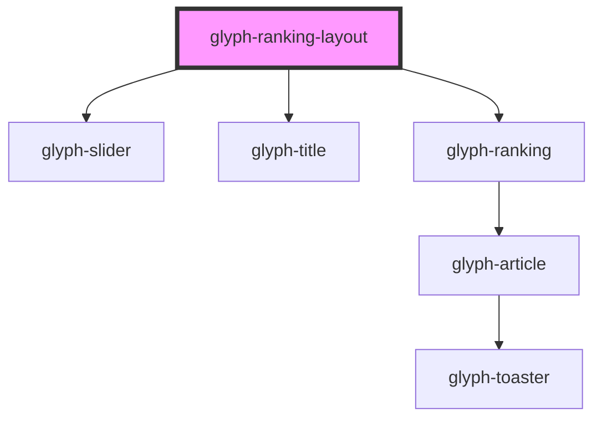

# glyph-ranking-layout

<!-- Auto Generated Below -->

## Properties

| Property      | Attribute    | Description              | Type                         | Default                     |
| ------------- | ------------ | ------------------------ | ---------------------------- | --------------------------- |
| `columnGap`   | `column-gap` | Distance between columns | `string`                     | `'15%'`                     |
| `i18n`        | --           | Extra i18n translates    | `{ [key: string]: string; }` | `undefined`                 |
| `rankingData` | --           | Ranking data             | `RankingData[]`              | `undefined`                 |
| `rowGap`      | `row-gap`    | Distance between rows    | `string`                     | `'var(--gui-padding--xxl)'` |

## Dependencies

### Depends on

- [glyph-slider](../../slider)
- [glyph-title](../../title)
- [glyph-ranking](../../ranking)

### Graph

----------------------------------------------

