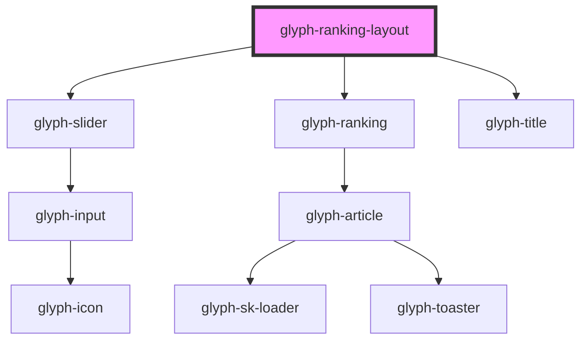

# glyph-ranking-layout

<!-- Auto Generated Below -->

## Properties

| Property                | Attribute                 | Description                                                                  | Type                         | Default                     |
| ----------------------- | ------------------------- | ---------------------------------------------------------------------------- | ---------------------------- | --------------------------- |
| `activeView`            | --                        | Active view layout                                                           | `RankingViewOptions`         | `undefined`                 |
| `aspectRatio`           | `aspect-ratio`            | Aspect ratio used to calculate loader height                                 | `number`                     | `340 / 512`                 |
| `basePath`              | `base-path`               | Base path to get assets                                                      | `string`                     | `undefined`                 |
| `columnGap`             | `column-gap`              | Distance between columns                                                     | `string`                     | `'15%'`                     |
| `compRankingData`       | --                        | Ranking comparable data                                                      | `RankingData[]`              | `undefined`                 |
| `i18n`                  | --                        | Extra i18n translates                                                        | `{ [key: string]: string; }` | `undefined`                 |
| `interface`             | `interface`               | Application interface                                                        | `string`                     | `UIInterface.classic`       |
| `loading`               | `loading`                 | Loading flag                                                                 | `boolean`                    | `false`                     |
| `loadingComparable`     | `loading-comparable`      | Loading comparable flag                                                      | `boolean`                    | `false`                     |
| `locale`                | `locale`                  | **optional** force locale change if html lang is not interpreted             | `string`                     | `undefined`                 |
| `rankingData`           | --                        | Ranking data                                                                 | `RankingData[]`              | `undefined`                 |
| `rowGap`                | `row-gap`                 | Distance between rows                                                        | `string`                     | `'var(--gui-padding--xxl)'` |
| `useBackdropDecoration` | `use-backdrop-decoration` | Decorate with backdrop filter, solves some performance issues (in storybook) | `boolean`                    | `true`                      |

## Dependencies

### Depends on

- [glyph-slider](../../slider)
- [glyph-ranking](../../ranking)
- [glyph-title](../../title)

### Graph

----------------------------------------------

