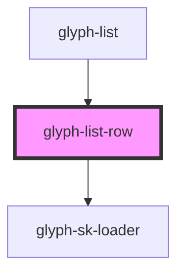

# fib-list-row

<!-- Auto Generated Below -->

## Properties

| Property       | Attribute    | Description                   | Type                      | Default     |
| -------------- | ------------ | ----------------------------- | ------------------------- | ----------- |
| `expandHandle` | --           | expand row callback           | `(row: Row) => () => any` | `undefined` |
| `expandable`   | `expandable` | expandable flag               | `boolean`                 | `undefined` |
| `fields`       | --           | Render fields                 | `string[]`                | `undefined` |
| `i18n`         | `i-1-8n`     | i18n object with translations | `any`                     | `{}`        |
| `isTotal`      | `is-total`   | total flag                    | `boolean`                 | `undefined` |
| `row`          | --           | row data                      | `Row`                     | `undefined` |

## Dependencies

### Used by

 - [glyph-list](../..)

### Depends on

- [glyph-sk-loader](../../../skeleton-loader)

### Graph

----------------------------------------------

