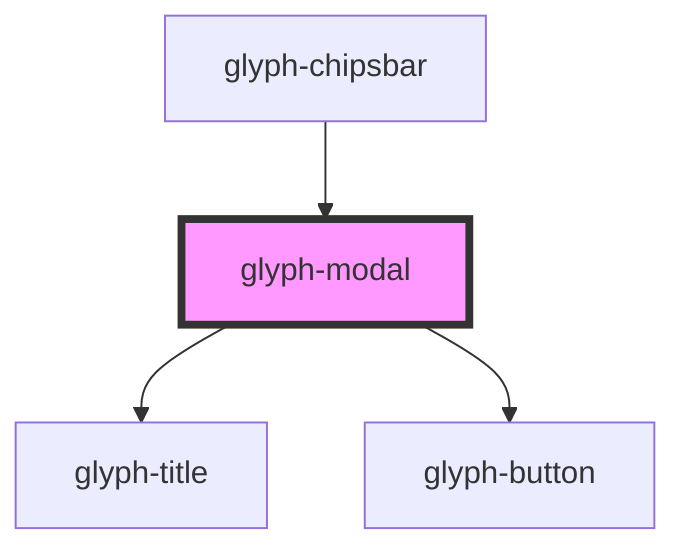

# glyph-modal

<!-- Auto Generated Below -->

## Properties

| Property       | Attribute       | Description                               | Type      | Default     |
| -------------- | --------------- | ----------------------------------------- | --------- | ----------- |
| `applyButton`  | `apply-button`  | Apply button text. Renders button if set  | `string`  | `undefined` |
| `cancelButton` | `cancel-button` | Cancel button text. Renders button if set | `string`  | `undefined` |
| `closeButton`  | `close-button`  | Close button flag                         | `boolean` | `undefined` |
| `interface`    | `interface`     | Interface type ['MODERN', 'CLASSIC']      | `string`  | `undefined` |
| `maxHeight`    | `max-height`    | Modal min height                          | `string`  | `undefined` |
| `maxWidth`     | `max-width`     | Modal min with                            | `string`  | `'80%'`     |
| `modalTitle`   | `modal-title`   | Modal title                               | `string`  | `undefined` |
| `padded`       | `padded`        | Modal padded flag                         | `boolean` | `true`      |
| `visible`      | `visible`       | Modal visibility flag                     | `boolean` | `undefined` |

## Events

| Event    | Description  | Type               |
| -------- | ------------ | ------------------ |
| `apply`  | apply event  | `CustomEvent<any>` |
| `cancel` | cancel event | `CustomEvent<any>` |
| `close`  | close event  | `CustomEvent<any>` |

## Dependencies

### Used by

 - [glyph-chipsbar](../layouts/chipsbar)

### Depends on

- [glyph-title](../title)
- [glyph-button](../button)

### Graph

----------------------------------------------

