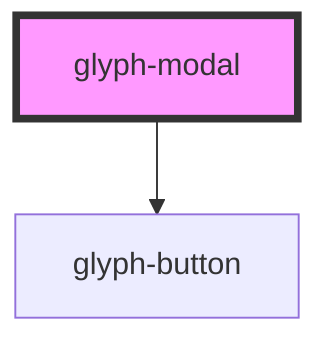

# glyph-modal

<!-- Auto Generated Below -->

## Properties

| Property       | Attribute       | Description                               | Type                                        | Default               |
| -------------- | --------------- | ----------------------------------------- | ------------------------------------------- | --------------------- |
| `applyButton`  | `apply-button`  | Apply button text. Renders button if set  | `string`                                    | `undefined`           |
| `cancelButton` | `cancel-button` | Cancel button text. Renders button if set | `string`                                    | `undefined`           |
| `closeButton`  | `close-button`  | Close button flag                         | `boolean`                                   | `undefined`           |
| `interface`    | `interface`     | Interface type ['MODERN', 'CLASSIC']      | `UIInterface.classic \| UIInterface.modern` | `UIInterface.classic` |
| `modalTitle`   | `modal-title`   | Modal title                               | `string`                                    | `undefined`           |
| `visible`      | `visible`       | Modal visibility flag                     | `boolean`                                   | `undefined`           |

## Events

| Event    | Description  | Type               |
| -------- | ------------ | ------------------ |
| `apply`  | apply event  | `CustomEvent<any>` |
| `cancel` | cancel event | `CustomEvent<any>` |
| `close`  | close event  | `CustomEvent<any>` |

## Dependencies

### Depends on

- [glyph-button](../button)

### Graph

----------------------------------------------

