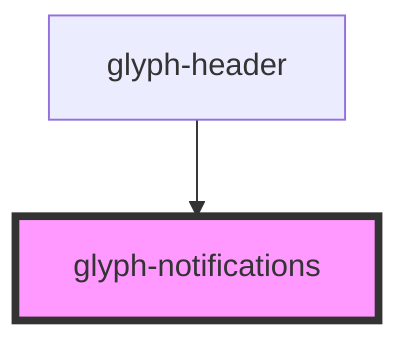

# glyph-notifications

<!-- Auto Generated Below -->

## Properties

| Property          | Attribute | Description                                                  | Type         | Default     |
| ----------------- | --------- | ------------------------------------------------------------ | ------------ | ----------- |
| `outsideCallback` | --        | Event triggered when user clicks outside component container | `() => void` | `undefined` |

## Dependencies

### Used by

 - [glyph-header](../layouts/header)

### Graph

----------------------------------------------

