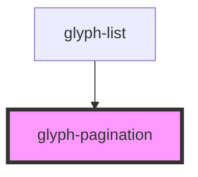

# glyph-pagination

<!-- Auto Generated Below -->

## Properties

| Property     | Attribute     | Description                                                | Type     | Default     |
| ------------ | ------------- | ---------------------------------------------------------- | -------- | ----------- |
| `activePage` | `active-page` | Active page                                                | `number` | `undefined` |
| `limit`      | `limit`       | Pagination limit in first group                            | `number` | `undefined` |
| `pageGroups` | `page-groups` | Number of pages to be grouped if list is larger than limit | `number` | `3`         |
| `pages`      | `pages`       | Number of pages to be rendered                             | `number` | `undefined` |

## Events

| Event     | Description                 | Type                  |
| --------- | --------------------------- | --------------------- |
| `setPage` | Event emitted on page click | `CustomEvent<number>` |

## Dependencies

### Used by

 - [glyph-list](../list)

### Graph

----------------------------------------------

