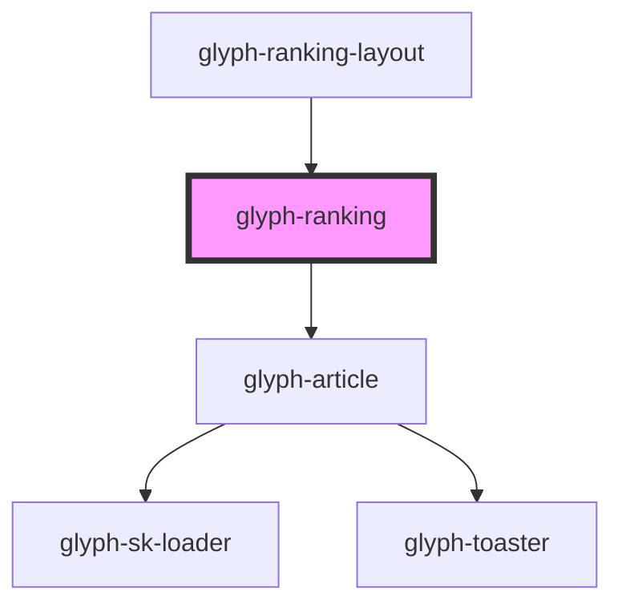

# glyph-ranking

<!-- Auto Generated Below -->

## Properties

| Property                | Attribute                 | Description                                                                                     | Type                         | Default                     |
| ----------------------- | ------------------------- | ----------------------------------------------------------------------------------------------- | ---------------------------- | --------------------------- |
| `aspectRatio`           | `aspect-ratio`            | Aspect ratio used to calculate loader height                                                    | `number`                     | `340 / 512`                 |
| `basePath`              | `base-path`               | Base path to get assets                                                                         | `string`                     | `''`                        |
| `columnGap`             | `column-gap`              | Distance between columns                                                                        | `string`                     | `'15%'`                     |
| `columns`               | `columns`                 | Columns to render if ranking have more than 1 section, number of columns will apply per section | `number`                     | `3`                         |
| `gap`                   | `gap`                     | Distance applied to both axes                                                                   | `string`                     | `undefined`                 |
| `i18n`                  | --                        | Extra i18n translation object                                                                   | `{ [key: string]: string; }` | `{}`                        |
| `imageType`             | `image-type`              | Image type to render image \| plain_image                                                       | `string`                     | `'image'`                   |
| `innerColumns`          | `inner-columns`           | Inner columns, sets how many columns should be rendered per column                              | `number`                     | `1`                         |
| `innerGap`              | `inner-gap`               | Distance between elements inside a column                                                       | `string`                     | `undefined`                 |
| `loading`               | `loading`                 | Loading flag                                                                                    | `boolean`                    | `false`                     |
| `locale`                | `locale`                  | **optional** force locale change if html lang is not interpreted                                | `string`                     | `undefined`                 |
| `parseImageUrl`         | --                        | **optional** Compose image url callback                                                         | `(image: string) => string`  | `undefined`                 |
| `rankingData`           | --                        | Ranking data                                                                                    | `RankingData[]`              | `undefined`                 |
| `rankingHeader`         | `ranking-header`          | (optional) ranking header. Applicable on single section ranking                                 | `string`                     | `undefined`                 |
| `rowGap`                | `row-gap`                 | Distance between rows                                                                           | `string`                     | `'var(--gui-padding--xxl)'` |
| `rows`                  | `rows`                    | Row to render                                                                                   | `number`                     | `1`                         |
| `useBackdropDecoration` | `use-backdrop-decoration` | Decorate with backdrop filter, solves some performance issues (in storybook)                    | `boolean`                    | `true`                      |

## Events

| Event          | Description                 | Type                                                     |
| -------------- | --------------------------- | -------------------------------------------------------- |
| `scrollChange` | Scrolled state change event | `CustomEvent<{ scrolled: boolean; scrollTop: number; }>` |

## Methods

### `changeScroll(scroll?: number, listeneable?: boolean) => Promise<void>`

This method will change ranking container scroll

#### Returns

Type: `Promise<void>`

## Dependencies

### Used by

 - [glyph-ranking-layout](../layouts/ranking)

### Depends on

- [glyph-article](../article)

### Graph

----------------------------------------------

