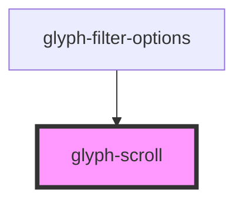

# glyph-scroll

<!-- Auto Generated Below -->

## Properties

| Property         | Attribute         | Description                               | Type     | Default     |
| ---------------- | ----------------- | ----------------------------------------- | -------- | ----------- |
| `containerClass` | `container-class` | class name to be used in scroll container | `string` | `undefined` |

## Dependencies

### Used by

 - [glyph-filter-options](../filter/components/options)

### Graph

----------------------------------------------

