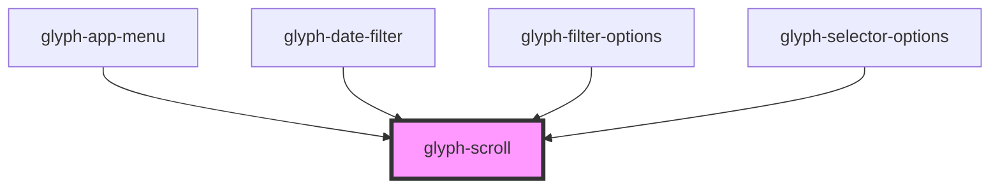

# glyph-scroll

<!-- Auto Generated Below -->

## Properties

| Property         | Attribute         | Description                               | Type                | Default     |
| ---------------- | ----------------- | ----------------------------------------- | ------------------- | ----------- |
| `containerClass` | `container-class` | class name to be used in scroll container | `string`            | `undefined` |
| `height`         | `height`          | height property                           | `number`            | `undefined` |
| `hideScrollBar`  | `hide-scroll-bar` | hide scrollbar                            | `boolean`           | `undefined` |
| `horizontal`     | `horizontal`      | show horizontal bar                       | `boolean`           | `undefined` |
| `initCallback`   | --                | scrollbar initialization callback         | `(ps: any) => void` | `undefined` |
| `scrollSpeed`    | `scroll-speed`    | scrolling speed                           | `number`            | `0.05`      |
| `tiny`           | `tiny`            | tinyh scrollbar                           | `boolean`           | `undefined` |
| `vertical`       | `vertical`        | show vertical bar                         | `boolean`           | `true`      |
| `width`          | `width`           | width property                            | `number`            | `undefined` |

## Dependencies

### Used by

 - [glyph-app-menu](../app-menu)
 - [glyph-date-filter](../date-filter)
 - [glyph-filter-options](../filter/components/options)
 - [glyph-selector-options](../selector/options)

### Graph

----------------------------------------------

