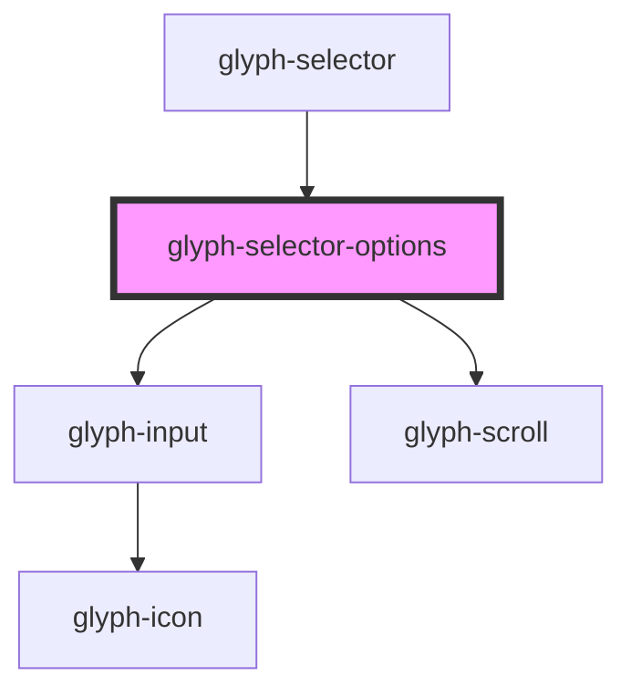

# glyph-selector-options

<!-- Auto Generated Below -->

## Properties

| Property            | Attribute            | Description                                                    | Type                               | Default     |
| ------------------- | -------------------- | -------------------------------------------------------------- | ---------------------------------- | ----------- |
| `closeEvent`        | --                   | Close event                                                    | `() => void`                       | `undefined` |
| `complexOptions`    | --                   | Complex selector options                                       | `ComplexSelectorOptions`           | `undefined` |
| `interface`         | `interface`          | Interface type ['MODERN', 'CLASSIC']                           | `string`                           | `undefined` |
| `maxHeight`         | `max-height`         | Max height configuration                                       | `number`                           | `300`       |
| `multiSelect`       | `multi-select`       | Multiselect flag                                               | `boolean`                          | `false`     |
| `optionClickEvent`  | --                   | Option click event                                             | `(option: SelectorOption) => void` | `undefined` |
| `options`           | --                   | Selector options                                               | `SelectorOption[]`                 | `undefined` |
| `searchPlaceholder` | `search-placeholder` | Search placeholder text. If defined a search input will render | `string`                           | `undefined` |

## Dependencies

### Used by

 - [glyph-selector](..)

### Depends on

- [glyph-input](../../input)
- [glyph-scroll](../../scroll)

### Graph

----------------------------------------------

