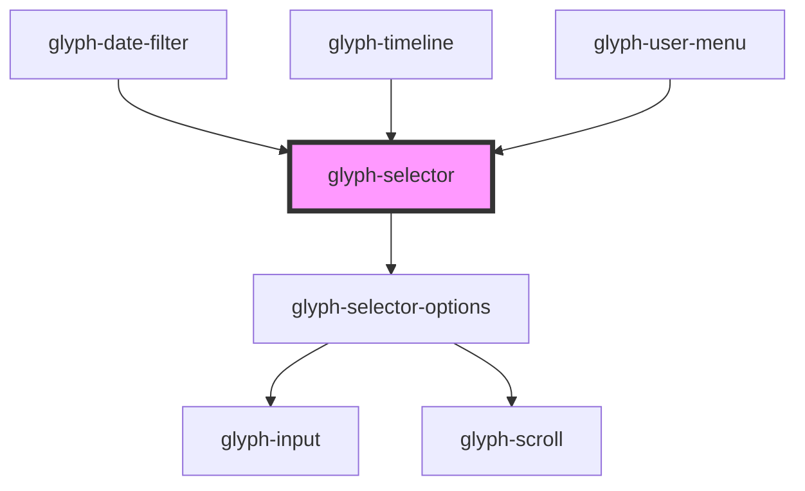

# glyph-selector

<!-- Auto Generated Below -->

## Properties

| Property            | Attribute            | Description                                                    | Type                                        | Default               |
| ------------------- | -------------------- | -------------------------------------------------------------- | ------------------------------------------- | --------------------- |
| `complexOptions`    | --                   | Complex selector options                                       | `ComplexSelectorOptions`                    | `undefined`           |
| `interface`         | `interface`          | Interface type ['MODERN', 'CLASSIC']                           | `UIInterface.classic \| UIInterface.modern` | `UIInterface.classic` |
| `label`             | `label`              | Selector label                                                 | `string`                                    | `undefined`           |
| `maxHeight`         | `max-height`         | Max height configuration                                       | `number`                                    | `300`                 |
| `multiSelect`       | `multi-select`       | Multiselect flag                                               | `boolean`                                   | `false`               |
| `options`           | --                   | Selector options                                               | `SelectorOption[]`                          | `undefined`           |
| `searchPlaceholder` | `search-placeholder` | Search placeholder text. If defined a search input will render | `string`                                    | `undefined`           |

## Events

| Event          | Description        | Type                          |
| -------------- | ------------------ | ----------------------------- |
| `optionSelect` | on change callback | `CustomEvent<SelectorOption>` |

## Dependencies

### Used by

 - [glyph-date-filter](../date-filter)
 - [glyph-timeline](../timeline)
 - [glyph-user-menu](../user-menu)

### Depends on

- [glyph-selector-options](options)

### Graph

----------------------------------------------

