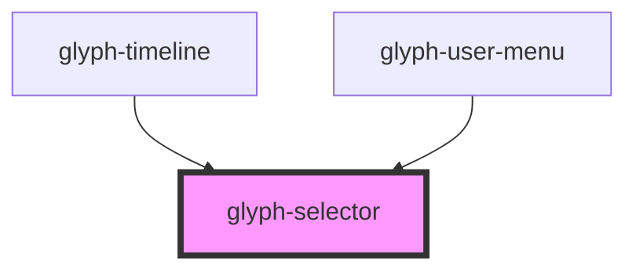

# glyph-selector

<!-- Auto Generated Below -->

## Properties

| Property         | Attribute      | Description                          | Type                                        | Default               |
| ---------------- | -------------- | ------------------------------------ | ------------------------------------------- | --------------------- |
| `complexOptions` | --             | Complex selector options             | `ComplexSelectorOptions`                    | `undefined`           |
| `interface`      | `interface`    | Interface type ['MODERN', 'CLASSIC'] | `UIInterface.classic \| UIInterface.modern` | `UIInterface.classic` |
| `label`          | `label`        | Selector label                       | `string`                                    | `undefined`           |
| `multiSelect`    | `multi-select` | Multiselect flag                     | `boolean`                                   | `false`               |
| `options`        | --             | Selector options                     | `SelectorOption[]`                          | `undefined`           |

## Events

| Event          | Description        | Type                          |
| -------------- | ------------------ | ----------------------------- |
| `optionSelect` | on change callback | `CustomEvent<SelectorOption>` |

## Dependencies

### Used by

 - [glyph-timeline](../timeline)
 - [glyph-user-menu](../user-menu)

### Graph

----------------------------------------------

