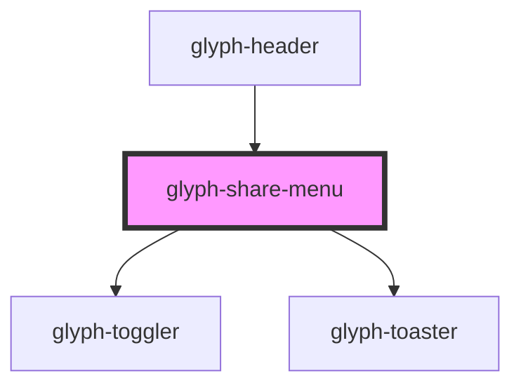

# glyph-share-menu

<!-- Auto Generated Below -->

## Properties

| Property          | Attribute      | Description                                                  | Type                                        | Default               |
| ----------------- | -------------- | ------------------------------------------------------------ | ------------------------------------------- | --------------------- |
| `appSubtitle`     | `app-subtitle` | Application subtitle                                         | `string`                                    | `undefined`           |
| `appTitle`        | `app-title`    | Application title                                            | `string`                                    | `undefined`           |
| `i18n`            | --             | Extra i18n translation object                                | `{ [key: string]: string; }`                | `{}`                  |
| `interface`       | `interface`    | Interface type ['MODERN', 'CLASSIC']                         | `UIInterface.classic \| UIInterface.modern` | `UIInterface.classic` |
| `outsideCallback` | --             | Event triggered when user clicks outside component container | `() => void`                                | `undefined`           |

## Dependencies

### Used by

 - [glyph-header](../header)

### Depends on

- [glyph-toggler](../toggler)
- [glyph-toaster](../toaster)

### Graph

----------------------------------------------

