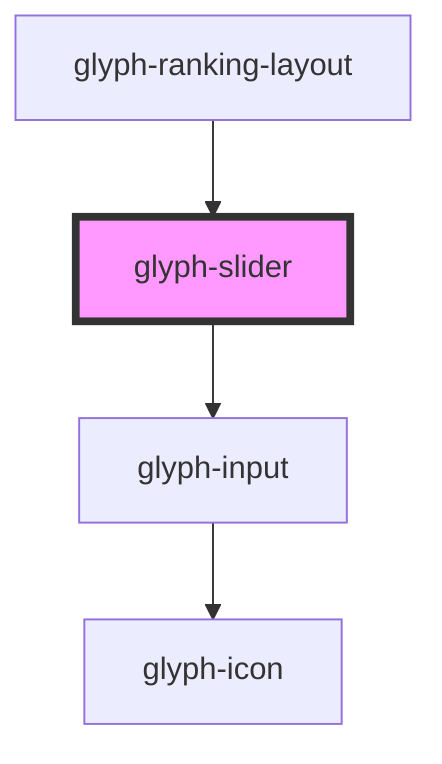

# glyph-slider

<!-- Auto Generated Below -->

## Properties

| Property       | Attribute       | Description                            | Type     | Default     |
| -------------- | --------------- | -------------------------------------- | -------- | ----------- |
| `currentValue` | `current-value` | Current slider value between 0 and 100 | `number` | `0`         |
| `options`      | --              | Slider options                         | `any[]`  | `undefined` |

## Events

| Event          | Description         | Type                                           |
| -------------- | ------------------- | ---------------------------------------------- |
| `optionChange` | Option change event | `CustomEvent<{ option: any; value: number; }>` |

## Dependencies

### Used by

 - [glyph-ranking-layout](../layouts/ranking)

### Depends on

- [glyph-input](../input)

### Graph

----------------------------------------------

