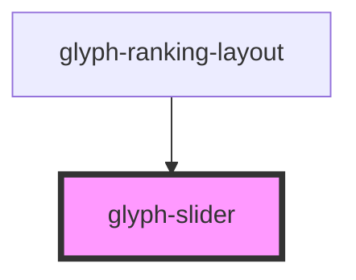

# glyph-slider

<!-- Auto Generated Below -->

## Properties

| Property  | Attribute | Description    | Type    | Default     |
| --------- | --------- | -------------- | ------- | ----------- |
| `options` | --        | Slider options | `any[]` | `undefined` |

## Events

| Event          | Description         | Type               |
| -------------- | ------------------- | ------------------ |
| `optionChange` | Option change event | `CustomEvent<any>` |

## Dependencies

### Used by

 - [glyph-ranking-layout](../layouts/ranking)

### Graph

----------------------------------------------

