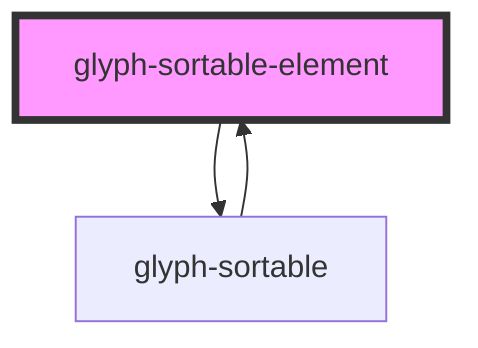

# glyph-sortable-element

<!-- Auto Generated Below -->

## Properties

| Property       | Attribute   | Description                                                                          | Type                            | Default     |
| -------------- | ----------- | ------------------------------------------------------------------------------------ | ------------------------------- | ----------- |
| `actionClick`  | --          | Action click callback                                                                | `() => any`                     | `undefined` |
| `childrenSort` | --          | Children sort callback                                                               | `(sortedList: string[]) => any` | `undefined` |
| `haveIcon`     | `have-icon` | This variable should be truthy if any element in list renders an icon to align items | `boolean`                       | `undefined` |
| `item`         | --          | Sortable item configuration                                                          | `SortableOption`                | `undefined` |
| `valueGetter`  | --          | Value renderer, if not set list will render `name` property                          | `(item: any) => string`         | `undefined` |

## Dependencies

### Used by

 - [glyph-sortable](../..)

### Depends on

- [glyph-sortable](../..)

### Graph

----------------------------------------------

