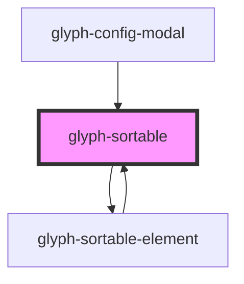

# glyph-sortable

<!-- Auto Generated Below -->

## Properties

| Property            | Attribute     | Description                                                                     | Type                            | Default     |
| ------------------- | ------------- | ------------------------------------------------------------------------------- | ------------------------------- | ----------- |
| `childSortCallback` | --            | Child value change                                                              | `(SortedList: string[]) => any` | `undefined` |
| `config`            | --            | [SortableJS](https://github.com/SortableJS/Sortable#options) list configuration | `SortableOptions`               | `{}`        |
| `height`            | `height`      | height property (makes list scrollable)                                         | `number`                        | `undefined` |
| `isChildren`        | `is-children` | Children flag                                                                   | `boolean`                       | `undefined` |
| `list`              | --            | List to sort                                                                    | `SortableOption[]`              | `undefined` |
| `valueGetter`       | --            | Value renderer, if not set list will render `name` property                     | `(item: any) => string`         | `undefined` |

## Events

| Event                | Description                                               | Type                                 |
| -------------------- | --------------------------------------------------------- | ------------------------------------ |
| `add`                | Event emitted on drag end emitting new list configuration | `CustomEvent<string[]>`              |
| `childrenSortChange` | Event emitted on drag end emitting new list configuration | `CustomEvent<SortableChildrenEvent>` |
| `remove`             | Event emitted on drag end emitting new list configuration | `CustomEvent<string[]>`              |
| `sortChange`         | Event emitted on drag end emitting new list configuration | `CustomEvent<string[]>`              |

## Dependencies

### Used by

 - [glyph-config-modal](../layouts/chipsbar/components)
 - [glyph-sortable-element](./components/sortable-element)

### Depends on

- [glyph-sortable-element](./components/sortable-element)

### Graph

----------------------------------------------

