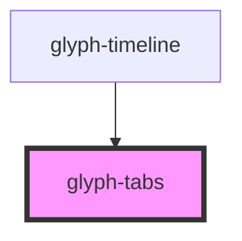

# glyph-tabs

<!-- Auto Generated Below -->

## Properties

| Property   | Attribute   | Description                      | Type                             | Default          |
| ---------- | ----------- | -------------------------------- | -------------------------------- | ---------------- |
| `tabStyle` | `tab-style` | Tab rendering style big \| small | `TabStyle.big \| TabStyle.small` | `TabStyle.small` |
| `tabs`     | --          | Component tabs                   | `Tab[]`                          | `undefined`      |

## Events

| Event       | Description         | Type               |
| ----------- | ------------------- | ------------------ |
| `tabSelect` | Tab selection event | `CustomEvent<Tab>` |

## Dependencies

### Used by

 - [glyph-timeline](../timeline)

### Graph

----------------------------------------------

