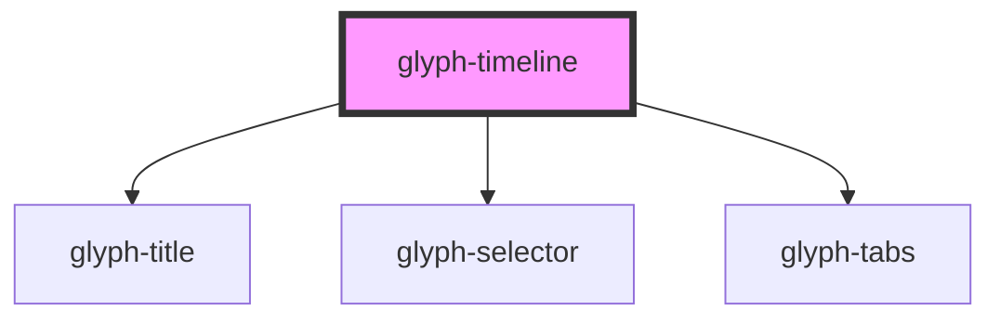

# glyph-timeline

<!-- Auto Generated Below -->

## Properties

| Property         | Attribute   | Description                          | Type                                        | Default               |
| ---------------- | ----------- | ------------------------------------ | ------------------------------------------- | --------------------- |
| `calendarEvents` | --          | Calendar events                      | `TimelineEvent[]`                           | `undefined`           |
| `events`         | --          | Events                               | `TimelineEvent[]`                           | `undefined`           |
| `i18n`           | --          | Extra i18n translation object        | `{ [key: string]: string; }`                | `{}`                  |
| `interface`      | `interface` | Interface type ['MODERN', 'CLASSIC'] | `UIInterface.classic \| UIInterface.modern` | `UIInterface.classic` |

## Dependencies

### Depends on

- [glyph-title](../title)
- [glyph-selector](../selector)
- [glyph-tabs](../tabs)

### Graph

----------------------------------------------

