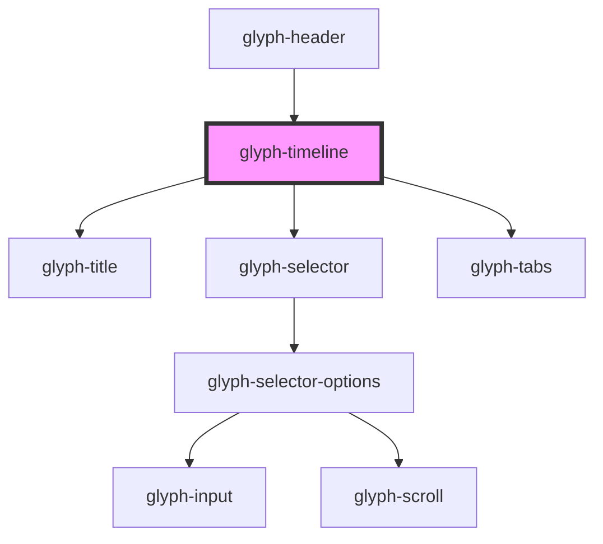

# glyph-timeline

<!-- Auto Generated Below -->

## Properties

| Property          | Attribute   | Description                                                      | Type                                        | Default               |
| ----------------- | ----------- | ---------------------------------------------------------------- | ------------------------------------------- | --------------------- |
| `basePath`        | `base-path` | Base path to get assets dir                                      | `string`                                    | `undefined`           |
| `calendarEvents`  | --          | Calendar events                                                  | `TimelineEvent[]`                           | `undefined`           |
| `events`          | --          | Events                                                           | `TimelineEvent[]`                           | `undefined`           |
| `i18n`            | --          | Extra i18n translation object                                    | `{ [key: string]: string; }`                | `{}`                  |
| `interface`       | `interface` | Interface type ['MODERN', 'CLASSIC']                             | `UIInterface.classic \| UIInterface.modern` | `UIInterface.classic` |
| `locale`          | `locale`    | **optional** force locale change if html lang is not interpreted | `string`                                    | `undefined`           |
| `outsideCallback` | --          | Event triggered when user clicks outside component container     | `() => void`                                | `undefined`           |

## Dependencies

### Used by

 - [glyph-header](../layouts/header)

### Depends on

- [glyph-title](../title)
- [glyph-selector](../selector)
- [glyph-tabs](../tabs)

### Graph

----------------------------------------------

