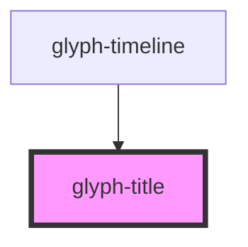

# glyph-title

<!-- Auto Generated Below -->

## Properties

| Property    | Attribute    | Description | Type     | Default     |
| ----------- | ------------ | ----------- | -------- | ----------- |
| `titleText` | `title-text` | title text  | `string` | `undefined` |

## Dependencies

### Used by

 - [glyph-timeline](../timeline)

### Graph

----------------------------------------------

