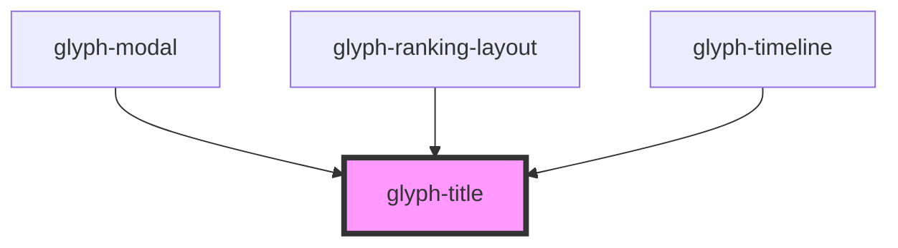

# glyph-title

<!-- Auto Generated Below -->

## Properties

| Property    | Attribute   | Description     | Type     | Default     |
| ----------- | ----------- | --------------- | -------- | ----------- |
| `interface` | `interface` | interface input | `string` | `undefined` |
| `text`      | `text`      | title text      | `string` | `undefined` |

## Dependencies

### Used by

 - [glyph-modal](../modal)
 - [glyph-ranking-layout](../layouts/ranking)
 - [glyph-timeline](../timeline)

### Graph

----------------------------------------------

