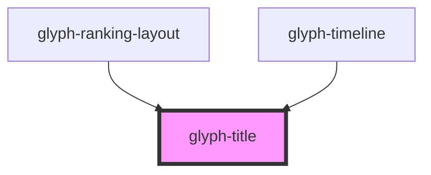

# glyph-title

<!-- Auto Generated Below -->

## Properties

| Property    | Attribute   | Description     | Type                                                                | Default               |
| ----------- | ----------- | --------------- | ------------------------------------------------------------------- | --------------------- |
| `interface` | `interface` | interface input | `UIInterface.classic \| UIInterface.modern \| UIInterface.redesign` | `UIInterface.classic` |
| `text`      | `text`      | title text      | `string`                                                            | `undefined`           |

## Dependencies

### Used by

 - [glyph-ranking-layout](../layouts/ranking)
 - [glyph-timeline](../timeline)

### Graph

----------------------------------------------

