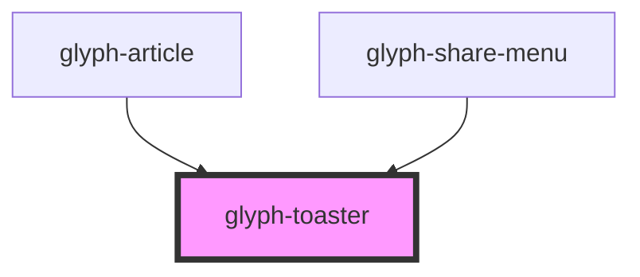

# glyph-toaster

<!-- Auto Generated Below -->

## Properties

| Property  | Attribute  | Description                           | Type                         | Default     |
| --------- | ---------- | ------------------------------------- | ---------------------------- | ----------- |
| `eventId` | `event-id` | Id of event that trigger toaster show | `string`                     | `undefined` |
| `i18n`    | --         | Extra i18n translation object         | `{ [key: string]: string; }` | `{}`        |
| `ttl`     | `ttl`      | Time to live for shown toaster        | `number`                     | `undefined` |

## Dependencies

### Used by

 - [glyph-article](../article)
 - [glyph-share-menu](../share-menu)

### Graph

----------------------------------------------

