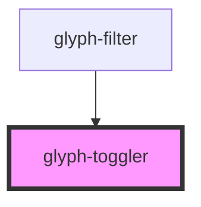

# glyph-toggler

<!-- Auto Generated Below -->

## Properties

| Property   | Attribute | Description    | Type        | Default     |
| ---------- | --------- | -------------- | ----------- | ----------- |
| `active`   | `active`  | Toggler state  | `boolean`   | `false`     |
| `callback` | --        | Click callback | `() => any` | `undefined` |

## Dependencies

### Used by

 - [glyph-filter](../filter)

### Graph

----------------------------------------------

